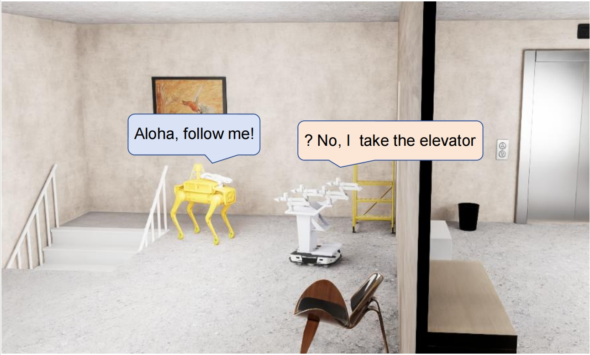

# Cross-floor Navigation for Mobile Manipulator



Existing works investigated the cross-floor indoor navigation of quadruped robots. However, the mobile manipulator, **mobile ALOHA**, due to its motion constraints, cannot navigate across floors using stairs.

---

## 📌 Dataset and Scene
This project provides **a dataset and simulated environment** for testing cross-floor navigation using a mobile manipulator. The dataset includes:
- **RGB image** representing the RGB image from on-board camera.
- **Depth image** representing the Depth image from on-board camera.
- **Camera pose** 6D camera pose of on-board camera.
- **Semantic label** for each frame include a json file with the groundtruth label.

Scenes are created as USD file and tested in **Isaac Sim 4.0.0**, allowing realistic simulation for multi-floor navigation.

---

## 🔧 Installation
To set up the environment, install the required dependencies in Isaac Sim default python environment:

```bash
cd <default Isaac Sim install path>
./python.sh -m pip install open3d
./python.sh -m pip install open-clip
```

---

## 🚀 RUN

```bash
./python.sh ./<repo_name>/test_all_actions.py
```
---
